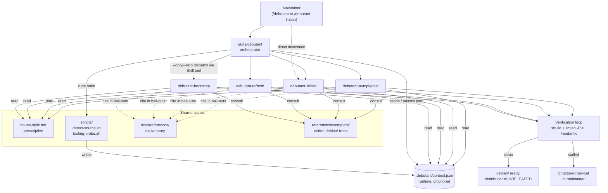

# Plan: `debutant` — Debian packaging skills for LLMs

## Context

`debutant` will provide Claude Code skills that automate common Debian
packaging maintenance tasks: bootstrapping a new package, refreshing
an existing `debian/` directory to current practice, adding
autopkgtest coverage, and resolving lintian issues.

**Current repo state** (verified): the only files are `workshop.yaml`
(Canonical workshop runner pinning `claude-code` on Ubuntu 24.04) and
`.gitignore`. There is no `skills/` directory yet — everything in
this plan is greenfield.

The intended user is a Debian/Ubuntu package maintainer who wants an
LLM to handle the mechanical parts of packaging while keeping the
maintainer in the loop for judgement calls. Output must be
Debian-archive-quality: not a rough draft, but `lintian`-clean,
`sbuild`-clean, autopkgtest-passing packaging that a DD would sign
and upload.

Design decisions locked in with the user:
- **Architecture**: single orchestrator skill + multiple worker
  skills, selected via `--only` / `--skip` flags.
- **Distro scope**: Debian-first, Ubuntu specifics as an overlay.
- **Authority for "good packaging"**: Debian Policy + DEP-* + devref,
  plus a DD-judgement house-style file, plus tooling output (lintian,
  debputy, blhc, hardening-check) as an *indicator* — not blindly
  obeyed. Reference-corpus is **hybrid**: a small set of vetted
  exemplar packages ships under `references/exemplars/` and is
  consulted by default; a maintainer can override the path or
  disable.
- **Knowledge base**: short curated docs under `docs/references/`
  cover Debian-ecosystem practices (DEP summaries, build-tool
  tradeoffs, VCS workflows, release process). Workers cite them in
  bail-out summaries; maintainers read them directly.
- **Verification**: mandatory build+lint loop, but bail out to the
  human after a bounded number of iterations or when the diff
  exceeds a size threshold.

## Architecture & flow



Each worker skill is **independently invocable** (a maintainer can
call `/debutant-lintian` directly without the orchestrator) but also
**designed to be chained** by the orchestrator, which pre-populates
the shared runtime context so workers don't re-probe.

### Skill format (applies to every skill in this plan)

Each `skills/<name>/SKILL.md` is a markdown file with YAML
frontmatter:

```yaml
---
name: <skill-name>          # must match directory name
description: <one sentence; controls when Claude invokes the skill>
---
```

Body is the skill's prompt: instructions, references to scripts under
`scripts/`, references to shared assets by repo-relative path. The
orchestrator's body documents `--only=<phase[,phase…]>` and
`--skip=<phase[,phase…]>` parsing of the Skill tool's `args` string,
and dispatches by re-invoking the Skill tool with the appropriate
worker name.

### Runtime context

Workers consume `.debutant/context.json` in the workspace
(gitignored, added to `.gitignore` in Phase 1). Schema documented in
`skills/debutant/shared-context.md`:

```
{
  "language":          "c|go|rust|python|...",
  "build_system":      "autotools|meson|cmake|cargo|...",
  "has_debian_dir":    true|false,
  "has_quilt_patches": true|false,
  "debian_branch":     "master|debian/latest|debian/sid|...",
  "upstream_vcs":      "git|hg|tarball|...",
  "tooling": {
    "sbuild":      "x.y.z|null",
    "autopkgtest": "x.y.z|null",
    "lintian":     "x.y.z|null",
    "debputy":     "x.y.z|null",
    "wrap-and-sort": "x.y.z|null",
    "gbp":         "x.y.z|null"
  },
  "iteration_budget":  { "max_attempts": 3, "diff_threshold_lines": 200 }
}
```

When a worker is invoked directly (no orchestrator), it generates the
file itself by running the same probe scripts.

## Phased implementation

The plan is sized for four sequential PRs. Each phase ends with
something usable; Phase 1 establishes the contract every later phase
depends on.

### Phase 1 — Foundations (PR 1)

Build before any worker. Defines what every worker can assume.

Files to create:

- `skills/debutant/SKILL.md` — orchestrator stub. Frontmatter
  `description: Debian packaging assistant: bootstrap, refresh,
  lintian, and autopkgtest workers.` Body documents `--only`/`--skip`
  flag parsing; full dispatch logic deferred to Phase 4.
- `skills/debutant/house-style.md` — the prescriptive DD-judgement
  file. Dated, versioned (header `Last reviewed: YYYY-MM-DD`),
  reviewed quarterly. Each rule cites Policy section, devref
  chapter, DEP number, or marks itself "DD-judgement". Initial
  rules:
  - `debhelper-compat (= 13)` default; 14 only when explicitly
    opted in
  - `Standards-Version`: latest known good (pin a value, don't
    auto-bump)
  - `Rules-Requires-Root: no` always; `binary-targets` only when
    setuid/setgid files are detected
  - Source format `3.0 (quilt)` for upstream-with-debian; `3.0
    (native)` only for genuinely native packages
  - Prefer `dh-sequence-*` virtual Build-Depends over `--with` in
    `debian/rules`
  - `debian/rules` minimal: `#!/usr/bin/make -f` + `%: ; dh $@`,
    only override targets when necessary, never preemptively
  - `wrap-and-sort -ast` on `debian/control`, `debian/copyright`,
    `debian/*.install`
  - `debian/watch` v4, `pgpmode=auto` only with
    `debian/upstream/signing-key.asc` present
  - `debian/copyright` in machine-readable DEP-5 format always
  - `debian/changelog`: `UNRELEASED` distribution until human
    explicitly approves a release
  - Salsa-CI enabled (`debian/salsa-ci.yml`) for new packages
  - DEP-14 branch naming for Vcs-Git
- `skills/debutant/shared-context.md` — documents the
  `.debutant/context.json` schema (above), the iteration-budget
  envelope (defaults: 3 retries per error class, 200-line diff
  threshold), and the reference-corpus contract (default path
  `references/exemplars/`, override via `--reference=<path>`,
  disable via `--reference=none`).
- `skills/debutant/scripts/detect-source.sh` — emits the JSON in
  the schema above.
- `skills/debutant/scripts/tooling-probe.sh` — populates the
  `tooling` block.
- `skills/debutant/scripts/verify.sh` — runs `sbuild` and
  `lintian -EvIL +pedantic`, emits a structured JSON result
  `{ build_ok, lint_tags: [...], same_class_as_previous }` for
  workers' verification loop. Loop control (decide / retry / bail)
  is **prompt-driven** in each worker — bash can't make judgement
  calls.
- `docs/references/{build-tools,deps,vcs-workflows,tooling,release-process,salsa-ci}.md`
   — one short page each, links to canonical sources. Workers cite
   them by path in bail-out summaries.
- `references/exemplars/.gitkeep` — directory placeholder; real
  exemplars added as discovered.
- `.gitignore` — append `.debutant/`.
- `README.md` — what `debutant` is, how to invoke, scope, link to
  `docs/`.
- `docs/developer.md` — how to add a new worker.

`docs/references/*.md` are **explanatory** (for humans).
`house-style.md` is **prescriptive** (for skills) and cites the
`docs/references/` pages by path rather than restating them.

Verification: scripts run cleanly on this empty repo and on a
sample Debian source tree (e.g., `apt-get source hello`); JSON
output matches the documented schema.

### Phase 2 — First worker: `debutant-lintian` (PR 2)

Chosen as the proof-of-concept worker because it's the most
contained: it consumes lintian output and produces small, isolated
changes. Validates the verification-loop pattern before three more
workers are built.

Files to create:

- `skills/debutant-lintian/SKILL.md` — frontmatter
  `description: Resolve lintian -EvIL +pedantic tags on a Debian
  source package.` Body workflow:
  1. Ensure `.debutant/context.json` exists; generate if missing.
  2. Run `lintian -EvIL +pedantic`.
  3. Classify each tag: *fix in packaging*, *fix upstream via
     patch*, *justified override*, *won't fix*.
  4. Fixes: smallest patch that addresses the tag without side
     effects.
  5. Overrides: write to `debian/source/lintian-overrides` or
     `debian/$pkg.lintian-overrides`, **always with a `# comment`
     line** giving the reason. Never blanket-suppress.
  6. Upstream issues: write a DEP-3 quilt patch under
     `debian/patches/`, add to `series`.
  7. Re-run verify; loop with bail-out (per Step 6).
- `tests/fixtures/lintian-tags/` — a known-broken `debian/` dir
  with deliberate tags (e.g., missing copyright entry, wrong
  Standards-Version, missing manual page). Used to drive
  development and to assert behaviour later.
- `tests/run-lintian.sh` — invokes the worker via
  `claude --bare --print` against the fixture; exits non-zero if
  remaining lintian tags are not in the expected set.

Verification: script in `tests/run-lintian.sh` exits 0 against the
fixture; bail-out triggers when an unfixable tag is injected
(e.g., a fictitious tag name).

### Phase 3 — Remaining workers (PR 3)

Each follows the pattern proven in Phase 2: own `SKILL.md`,
verification loop, fixture, test script.

- `skills/debutant-bootstrap/SKILL.md` — Create `debian/` for an
  unpackaged upstream tree.
  1. Run `detect-source` and `tooling-probe`.
  2. Generate `control`, `copyright`, `rules`, `changelog`,
     `watch`, `source/format`, `source/lintian-overrides` (empty),
     `salsa-ci.yml` per house style.
  3. Use `dh_make` only as a structural reference — **never** ship
     its output unchanged.
  4. Run verify loop (Phase 1's `verify.sh`).
- `skills/debutant-refresh/SKILL.md` — Modernise an existing
  `debian/`. **Most dangerous worker** — mutates work the
  maintainer made deliberate choices about. Hard rules:
  - Default to **dry-run** (produce a diff, do not write).
    `--apply` flag required to write.
  - Never refactor `override_dh_*` targets without showing the
    maintainer.
  - Never change `Maintainer:` / `Uploaders:`.
  - Never bump `debian/changelog` (refresh ≠ release).
  - Each modernisation is a separate, labelled hunk in the diff
    with a one-line justification linked to policy/devref/DD-style.

  Refresh checklist (opt-in per item via `--refresh-only=` flags):
  compat bump, Standards-Version bump, R³, `dh-sequence-*`
  migration, `wrap-and-sort` pass, watch v4 upgrade, DEP-5
  copyright normalisation, M-A audit (advisory only), Salsa-CI
  introduction.
- `skills/debutant-autopkgtest/SKILL.md` — Add or improve
  `debian/tests/`.
  - Detect language/framework; propose `Test-Command:` or per-test
    scripts.
  - Default `Restrictions:` to the minimum that passes; never
    `needs-root`/`isolation-container` without explicit maintainer
    approval.
  - For libraries: ABI smoke tests; for daemons: service-start
    tests with explicit approval.
  - Verify with `autopkgtest -- null` first (cheapest), then
    `autopkgtest-virt-qemu` or `-lxc` if available.

Fixtures (one per worker, kept minimal):

- `tests/fixtures/hello-c-autotools/` — clean autotools source for
  `bootstrap`.
- `tests/fixtures/stale-debian/` — outdated `debian/` for
  `refresh`; ships `expected.diff` for golden comparison.
- `tests/fixtures/no-tests/` — package with no `debian/tests/` for
  `autopkgtest`.

Each fixture has a `tests/run-<worker>.sh` driver mirroring
Phase 2's pattern.

### Phase 4 — Orchestrator wiring (PR 4)

Flesh out `skills/debutant/SKILL.md`:

- Parse `--only` / `--skip` from the Skill tool `args` string.
- Phase order: detect → (bootstrap **xor** refresh, based on
  `has_debian_dir`) → lintian → autopkgtest.
- Run probe scripts once, write `.debutant/context.json`, pass
  the path implicitly (workers read the well-known location).
- Between phases: print a one-paragraph transition summary so the
  maintainer sees the whole story in one transcript.
- Each phase gated by an explicit confirmation prompt unless
  `--auto` is passed.

Add `tests/run-orchestrator.sh` that runs end-to-end against
`hello-c-autotools/` and asserts a clean `sbuild` + `lintian` at
the end.

### Verification loop (used by all workers)

Pseudocode the worker's prompt encodes (not bash):

```
attempt = 0
repeats_per_class = {}
while attempt < BUDGET (default 3 per error class):
  result = scripts/verify.sh
  if result.build_ok and (result.lint_tags ⊆ justified_overrides):
    return success
  cls = classify(result)
  repeats_per_class[cls] += 1
  if repeats_per_class[cls] >= 2:
    bail_to_human(structured_summary)
  if cumulative_diff_lines > 200:
    confirm_with_human()
  attempt += 1
bail_to_human(structured_summary)
```

Iteration budget is **per-error-class**, not per-attempt.
Structured bail-out includes: what was tried, what failed, current
lintian/sbuild output, the proposed next step, and a question with
concrete options.

## Repo layout (target after Phase 4)

```
debutant/
├── workshop.yaml                  # already exists
├── .gitignore                     # +.debutant/
├── README.md
├── skills/
│   ├── debutant/                  # orchestrator
│   │   ├── SKILL.md
│   │   ├── house-style.md
│   │   ├── shared-context.md
│   │   └── scripts/
│   │       ├── detect-source.sh
│   │       ├── tooling-probe.sh
│   │       └── verify.sh
│   ├── debutant-bootstrap/SKILL.md
│   ├── debutant-refresh/SKILL.md
│   ├── debutant-lintian/SKILL.md
│   └── debutant-autopkgtest/SKILL.md
├── docs/
│   ├── developer.md
│   └── references/
│       ├── build-tools.md
│       ├── deps.md
│       ├── vcs-workflows.md
│       ├── tooling.md
│       ├── release-process.md
│       └── salsa-ci.md
├── references/
│   └── exemplars/                 # vetted debian/ trees workers consult
└── tests/
    ├── fixtures/
    │   ├── hello-c-autotools/
    │   ├── stale-debian/
    │   ├── no-tests/
    │   └── lintian-tags/
    ├── run-lintian.sh
    ├── run-bootstrap.sh
    ├── run-refresh.sh
    ├── run-autopkgtest.sh
    └── run-orchestrator.sh
```

## Key invariants (carried by every worker)

- **House style is policy, not vibes.** Every prescriptive choice
  in `house-style.md` cites Policy/devref/DEP, or says
  "DD-judgement" explicitly.
- **Never upload.** No worker invokes `dput`, `debrelease`, `dgit
  push`, or `git push`. `distribution=UNRELEASED` until the human
  edits the changelog.
- **Never touch upstream sources directly.** All upstream
  modifications go through `debian/patches/` with DEP-3 headers.
- **DEP-14 awareness.** Detect `debian/latest`, `debian/sid`
  branch layouts; don't assume `master` is the packaging branch.
- **Bail-out is a feature, not a failure.** A structured "I tried
  X, Y, Z and got stuck on $TAG — here are three options" is the
  desired terminal state when iteration stalls.
- **Workshop runs with `--dangerously-skip-permissions`.** Workers
  must be defensive about destructive ops on the workspace (no
  `rm -rf`, no `git clean -fdx` without confirmation, no
  `dpkg-source -x` over an existing tree).

## Caveats baked into worker prompts

- Don't trust `dh_make` output — structural reference only.
- `Multi-Arch: same` is a footgun; refresh proposes, never sets.
- `pgpmode=auto` requires `debian/upstream/signing-key.asc`.
- Lintian overrides without `# comment` justification are worse
  than the original tag.
- Refresh on someone else's package is socially fraught — default
  dry-run + per-hunk justification.
- `Salsa-CI` yaml format drifts; pin a tested template version
  in `house-style.md`, review quarterly.
- `Rules-Requires-Root: no` interacts with setuid/setgid; detect
  and warn (or set `R³: binary-targets`).
- DEP-5 copyright is hard to write correctly for vendored deps —
  default to asking the maintainer.
- Standards-Version, compat, debhelper add-on names drift; assume
  `house-style.md` entries go stale within ~6 months.

## Verification (how we test debutant itself)

Each phase ships its own driver script in `tests/`:

1. Phase 1: `bash skills/debutant/scripts/detect-source.sh` and
   `tooling-probe.sh` against this repo and an `apt-get source
   hello` checkout — JSON validates against `shared-context.md`
   schema.
2. Phase 2: `tests/run-lintian.sh` — fixture `lintian-tags/`
   ends with no remaining tags except justified overrides; an
   injected unfixable tag triggers structured bail-out.
3. Phase 3: `tests/run-bootstrap.sh` produces `sbuild`-clean,
   `lintian`-clean output for `hello-c-autotools/`;
   `tests/run-refresh.sh` against `stale-debian/` produces a diff
   matching `expected.diff`; `tests/run-autopkgtest.sh` against
   `no-tests/` produces a passing `autopkgtest -- null`.
4. Phase 4: `tests/run-orchestrator.sh` runs the full pipeline
   end-to-end against `hello-c-autotools/`; asserts
   `sbuild`-clean and `lintian`-clean.

All drivers invoke skills via `claude --bare --print` from the
workshop action so they're runnable both locally and in CI.

## Changes from the draft

- Acknowledged actual repo state (no `skills/` exists).
- Added flow diagram showing orchestrator/worker/shared-asset
  relationships.
- Phased the work into four sequential PRs so an implementer has a
  clear delivery order; Phase 2 is a single-worker proof of concept
  before three more workers land.
- Specified `SKILL.md` YAML frontmatter format and how skills
  invoke each other (Skill tool with worker name).
- Pinned the runtime context location: `.debutant/context.json` in
  the workspace (gitignored).
- Separated `references/exemplars/` (vetted `debian/` trees workers
  imitate) from `tests/fixtures/` (test inputs) — the draft
  conflated them.
- Promoted the verification loop into a shared `verify.sh` script
  that emits structured JSON; loop control is prompt-driven.
- Dropped the draft's Step 8 (natural-language layer) — Claude
  already routes intent to skills via the `description:`
  frontmatter; a wrapper is redundant.
- Slimmed Phase 3 fixtures from four bootstrap fixtures to one per
  worker; more can be added when a worker gains a regression bug.
